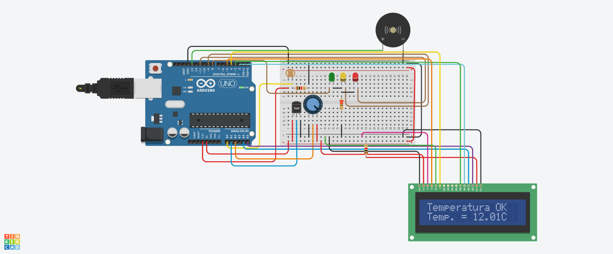

# Checkpoint 2 - O Caso da VinheriaAgnello

**Nome dos participantes:**
- Guilherme Silva Dos Santos
- Kayque Moraes Dias
- Laís Granero Bertoncello
- Wesley de Souza Silva
- Samuel Ramos de Almeida

**Turma:** 1º ESPX

**Ano:** 2023
___

## Descrição do desafio

Apresentamos a <a href="https://github.com/kayquemoraes/cp1-edge-computing.git">primeira parte do projeto</a> para os proprietários da Vinheriae eles ficaram muito satisfeitos com o resultado, porém, eles fizeram vários questionamentos em relação a apresentação:

>“ Isso é legal! O sistema me avisa que o ambiente está muito claro e consigo tomar as providências necessárias, mas também precisamos monitorar a temperatura e a umidade do ambiente... Ah sim, as luzinhas são interessantes, mas eu preciso saber exatamente qual a temperatura e a umidade do depósito, senão não consigo ter o controle!”

Diante dessa conversa, precisamos passar para a fase dois do projeto para atender a esses novos requisitos:

- Medir a temperatura e umidade do ambiente, para isso escolhemos o sensor integrado DHT11, que já possui uma biblioteca implementada para o Arduino. Precisamos aprender a instalar essa biblioteca no IDE do Arduino e a utiliza-la para ler a temperatura e umidade do ambiente.

- Os proprietários querem ver os valores de temperatura e umidade de alguma forma, por isso sugerimos usar um display para mostrar esses valores.

- Os sinais de alerta foram bem aceitos, e os proprietários querem estender essa funcionalidade para temperatura e umidade, portanto, além de sinalizar com os LEDs e o Buzzera luminosidade, também precisamos indicar quando a temperatura e/ou a umidade estiverem em níveis críticos.
___

## Desenvolvimento do projeto
O projeto consiste em implementar um sistema de monitoramento de temperatura, umidade e luminosidade em um depósito de uma Vinheria, utilizando o sensor integrado DHT11 e um display para mostrar as informações coletadas.

A primeira dificuldade encontrada foi a instalação da biblioteca do sensor DHT11 no IDE do Arduino, mas após pesquisas e leitura da documentação, a equipe conseguiu implementá-la com sucesso.

Em seguida, foi necessário desenvolver o algoritmo para coletar os valores de temperatura, umidade e luminosidade e apresentá-los no display. A média de pelo menos 5 leituras dos sensores foi implementada para garantir a precisão dos valores apresentados.

A próxima etapa foi implementar a lógica de alertas para indicar quando a temperatura e/ou umidade estiverem em níveis críticos. Foi necessário definir os limites de temperatura e umidade para determinar quando os LEDs e o buzzer deveriam ser acionados, e também quais mensagens deveriam ser apresentadas no display.

Durante o desenvolvimento do projeto, a equipe enfrentou alguns desafios, como ajustar a sensibilidade do sensor de luminosidade para garantir que o LED verde acendesse apenas em ambientes escuros e o LED vermelho apenas em ambientes muito claros.

Também foi necessário realizar testes para verificar a precisão das leituras dos sensores e ajustar as configurações para evitar possíveis interferências ou erros nas medições.

No geral, o projeto exigiu um trabalho minucioso e cuidadoso para garantir que os requisitos fossem atendidos e o sistema funcionasse de maneira confiável e eficiente. As dificuldades encontradas foram superadas com a colaboração da equipe e com a pesquisa e estudo das documentações e soluções disponíveis.

___
   
## Pré-requisitos

Para utilizar este projeto, você precisará de:

   #### HARDWARE  

   - Aduino Uno 
   - LDR 
   - Sensor DHT11
   - LCD 16 x 2
   - 3 LED´S (1x Verde, 1x Amarelo, 1x Vermelho)
   - 1 resistor de 220 ohm
   - 2 resistores de 1k ohm
   - Buzzer (buzina)
   - Protoboard 830 Pontos

   #### SOFTWARE 

   - Arduino IDE
   
___
## Como executar o projeto

Após a instalação do Arduíno IDE, você deve seguir os seguintes passos:

1. Faça download do código da pasta "Código Fonte" deste repositório.
2. Abra o código no Arduino IDE.
3. Conecte os sensores e componentes de acordo com as instruções fornecidas no código.

***Você também pode executar a simulação do projeto online através do link:*** https://www.tinkercad.com/things/4lzo4Li0xtb
___

## Video Explicativo
Link do vídeo: 